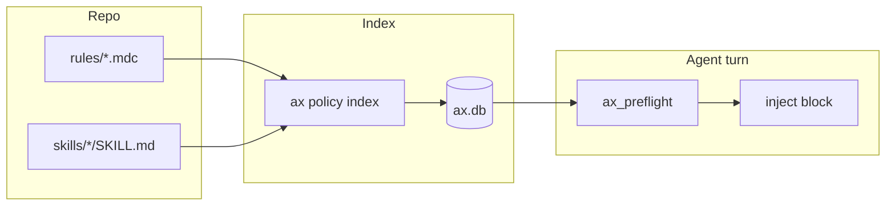
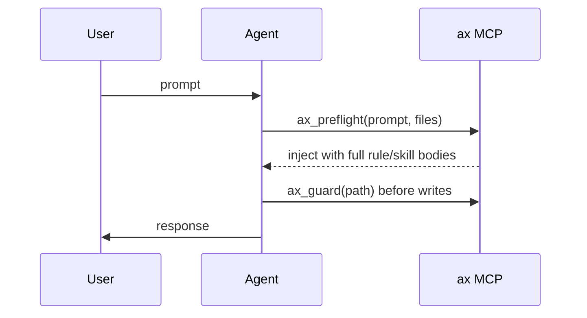

# ax — Graph it. Remember it. Ship it.

[](https://github.com/GaryWenneker/ax/releases/latest)
[](https://getax.wenneker.io)

**Current release: [v4.7.0](https://github.com/GaryWenneker/ax/releases/tag/v4.7.0)** — six-platform binaries (Windows, macOS, Linux/WSL2).

**ax** gives AI agents structured context — entirely on your machine. A **knowledge graph** (tree-sitter → SQLite), **memory vault** (decisions, git auto-capture, hybrid recall), **policy engine** (`.agents/` rules and skills), and **Command Center** (quality gates, SonarQube, token savings, MCP Logging / Quality, draft PRs) — one Rust binary, CLI + MCP.

**v4.7.0** adds **portable policy zip** packs (`ax policy pack zip` / `ax policy restore`, Command Center compose/restore with diffs), **grouped rules and skills**, git-share indicators for `.agents/`, and Command Center polish (one-line tags, Markdown caret, compact layout, macOS contrast, verbose MCP settings).

**v4.6.0** adds **Graph Start here** (Leiden subsystems, god-node tour, suggested questions) and an opt-in **Domain** overlay (`.ax/domain-graph.json`, agent `domain` skill) so you can show business flows without writing those nodes into `ax.db`. See [Architecture Insights](https://getax.wenneker.io/guides/architecture-insights/).

**v4.5.0** serves **graph-only snippets** (`ax_explore` / `ax_context` read indexed source from `ax.db`) and adds `policy.storage: "database"` with `ax policy import` / `ax policy export`.

**v4.4.0** **guards old-coder end-to-end** — `alwaysApply` skills inject on every turn (including empty prompts), `guard: require-skill: "old-coder"` blocks writes when the skill is missing, and preflight never hard-truncates always-apply rules or skills. Also ships **OKF export** (`ax export okf`) and preflight hardening (`projectPath`, degrade-on-error). See [Policy Engine](https://getax.wenneker.io/guides/policy-engine/) and [OKF](https://getax.wenneker.io/guides/okf/).

**v4.3.1** seeds **global old-coder policy** on init/install — evidence-first skills plus a CRITICAL `alwaysApply` rule for implementation work.

**v4.2.0** improves **policy filtering and Azure DevOps pack depth**:

- **Label autocomplete** on Policy → Rules / Skills (tag chips, AND filter; tags required on save). **Rules and Skills** lists group by a shared catalog (collapsible; empty folders hidden until assigned).
- **Expanded `azdo-fullstack` skills** — full workflows from refinement through release (`ax policy pack install azdo-fullstack --force` to refresh).
- **Pack install → database** — install force-imports into `ax.db` when storage mode is database.

**v4.1.0** added policy layers, default pack export, built-in packs, Policy Sync/Review, pricing catalog, and `ax desktop`.

**v4.0.0** is the **federation, share, and Command Center maturity** release:

- **Monorepo workspaces** — `ax init --workspace`, `ax index --all` / `ax sync --all`, workspace switcher, `ax policy pull`.
- **Multi-format graph export** — CLI + Graph page Download/Copy (JSON, GraphML, DOT, Mermaid, PlantUML, Cypher, HTML).
- **Extractor plugins** — process host (optional WASM); Settings → Plugins.
- **Optional ONNX embeddings** — dense vectors behind the `onnx` feature; Settings → Embeddings.
- **`ax ship --ci`** — headless quality gate + reusable `.github/workflows/ax-ship.yml`.
- **LSP bridge** — Exact edges via `ax-lsp`; Unresolved → enrich (limit, server checklist, report).
- **`ax share` + PWA** — LAN token gate, Settings → Sharing, opt-in install, Activity chip (SSE).
- **ax Mint default** — `#3ee4b2` Command Center theme; project browser tracks `--accent`. Settings also includes a **macOS** theme (System Settings–style charcoal + `#64d2ff`).

**v3.1.0** focused on **agent-side diagnostics, safer auto-commit, and policy flexibility** (diagnostics bridge, generic guard directives, Stop hook, ship auto-commit, MCP Logging polish, VS Code / Windsurf / Zed).

**v3.0.0** was a major release focused on **agent observability and savings accuracy**:

- **MCP Logging** — live Command Center table for `<project>/.ax/mcp-verbose-YYYY-MM-DD.log` (daily rotation; kind/date/tool filters, Call Inspector, scroll-up history, project switcher).
- **MCP Quality** — status-bar **Q** chip + slide-out; CLI `ax mcp audit` scores correlation, enrichment, and Explore-before-Grep waste; **Copy fixpack** for agent-ready briefs.
- **Cursor sessionStart hook** — `ax savings hook install` tags Composer chats with picker model + session id for savings and audit correlation.
- **Savings dashboard** — activity heatmap, period filter, TokenViz path graph, by-model rollups.
- **Architecture Graph** — interactive Leiden communities, god nodes, confidence-tagged edges, doc nodes.
- **Document inventory** — PDF / Office / Markdown as `Doc` nodes; `<ax_index>` on every `ax_preflight`.

**v2.1.14** adds **document inventory** — Markdown (parsed), PDF, Office, and other doc types as `Doc` nodes; `stats.docsByExtension` in `ax status`; `<ax_index>` auto-injected on every `ax_preflight` turn.

**v2.1.7** fixes **SonarQube dashboard responsiveness** in Command Center (iframe overlay, lighter dark-theme injection), improves **token savings counterfactuals** (line-range spans, related-file arrays, `AX_SAVINGS_CF_MODE`), and adds **running-state animations** across Ship, Savings, Sonar, and Settings.

**v2.1.6** adds the **memory vault** — `ax remember`, `ax recall`, `ax capture-git`, MCP `ax_remember` / `ax_recall`, Command Center **Memory** page (modal composer), git-hook auto-capture on commit, and hybrid FTS5 + vector recall injected via `ax_preflight`. **Savings** leaves beta with real BPE token counts and dollar estimates. **Cursor auth switching** — `ax cursor auth save/use/list` for fast subscription profile switching. **Command Center** gains a **project browser** (disk navigation, ax-project detection, in-browser `ax init`), modal-based forms, and a comprehensive SonarQube dark-theme proxy with auto-login, cached credentials, and localhost fallback.

**v2.1.5** adds **context-token savings tracking** — each MCP graph call logs estimated savings vs reading full files in `~/.ax/usage.db`. Query via `ax savings` and the **Savings** page in `ax web`. Import Cursor / Claude Code session logs with `ax savings import --all`.

**v2.1.3** adds **`ax policy storage status`** — explicit subcommand to show effective storage mode (project + global config paths and values).

**v2.1.2** improves **policy migration to database** — `--migrate` recursively scans the whole repo for `.mdc` rules and `SKILL.md` skills (not only `.ax/policy/`), with per-item interview questions before import. Use `--yes` to apply with parsed defaults.

**v2.1.1** adds **policy capture** — propose team rules from directive language in prompts, interview the user on options, save to `ax.db`. Plus `ax policy storage` and `ax upgrade --local` for dev releases.

**v2.0.0** adds an **IDE-agnostic policy engine** — project rules and skills in `.ax/policy/`, delivered via MCP, CLI, prompt-hook, and **ax web**. See [docs/POLICY_ENGINE.md](docs/POLICY_ENGINE.md).

**v2.1.0** adds the **Command Center** — git-aware quality gates, test-impact analysis, SSE dashboard, and draft PRs (Azure DevOps or GitHub). See [Command Center guide](https://getax.wenneker.io/guides/command-center/).

- **100% local** — no source code leaves your machine
- **Deterministic** — graph data comes from AST extraction, not LLM summaries
- **Agent-native** — MCP integration for Cursor, Claude Code, Codex, opencode, Gemini CLI, Antigravity, Kiro, Hermes, VS Code Copilot, Takumi 匠, Windsurf, Zed, and more
- **Native Rust** — single binary, no Node.js runtime required

Docs: [getax.wenneker.io](https://getax.wenneker.io) — MCP loop: [MCP Logging & Quality](https://getax.wenneker.io/guides/mcp-quality/)

---

## Quick start

```bash
# macOS / Linux
curl -fsSL https://getax.wenneker.io/install.sh | sh

# Windows (PowerShell)
irm https://getax.wenneker.io/install.ps1 | iex

# Or build from source
cargo install --path crates/ax-cli
```

Prebuilt releases ship **six** binaries (Windows x64/arm64, macOS Intel/Apple Silicon, Linux x64/arm64). WSL2 uses the Linux installer inside your WSL shell. See [installation docs](https://getax.wenneker.io/getting-started/installation/).

```bash
# Wire MCP into detected agents
ax install

# Index a project (creates .ax/ and builds the graph)
cd your-project
ax init

# Keep the index fresh while you work
ax sync --watch
```

---

## What ax builds

Each indexed project gets a `.ax/` directory:

| File | Purpose |
|------|---------|
| `ax.db` | SQLite database (WAL mode) — nodes, edges, files, FTS5, policy index |
| `ax.json` | Project config (extensions, ignore rules) |
| `policy/` | Rules (`.mdc`) and skills (`SKILL.md`) — IDE-agnostic agent instructions |
| `ship.toml` | Command Center config — quality gates, remote PR provider, Sonar (seeded on `ax init`) |
| `ax.lock` | Cross-process lock during indexing |
| `daemon.json` | MCP daemon metadata (when running) |

### Graph contents

- **Nodes** — functions, classes, methods, types, routes, components, files, …
- **Edges** — calls, imports, extends, implements, framework-specific links
- **Files** — structure + full-text symbol search (FTS5)

---

## How it works

```
source files
    │
    ▼
Extraction (tree-sitter, parallel via rayon)
    │  AST → nodes + edges + unresolved refs
    ▼
Storage (SQLite .ax/ax.db, schema v7, FTS5 + policy)
    │
    ▼
Resolution (imports, name-matching, framework synthesizers)
    │
    ▼
Graph queries (callers, callees, impact, explore, context)
    │
    ▼
CLI / MCP / markdown context for agents
```

### 1. Extraction

Native [tree-sitter](https://tree-sitter.github.io/) grammars parse source into ASTs. Language-specific extractors emit **nodes** and **edges**. Parsing runs in parallel (`AX_PARSE_WORKERS`, default: CPU count).

Supported languages include Rust, TypeScript/JavaScript, Python, Go, Java, and 30+ file extensions via framework extractors (React, Angular, Django, Spring, etc.). **Documentation files** (Markdown, PDF, Office, and other opaque types) are indexed as `Doc` nodes — see [Languages](https://getax.wenneker.io/reference/languages/).

### 2. Storage

Everything lands in `.ax/ax.db`:

- `nodes` + `edges` tables for the call/import graph
- `nodes_fts` virtual table (FTS5) for symbol search
- WAL mode for concurrent MCP reads during sync

### 3. Resolution

After extraction, unresolved references are matched to definitions:

- Import paths → source files
- Function calls → symbol definitions
- Class inheritance and framework patterns (routes, DI, JSX, …)

Some dynamic boundaries (callbacks, observers) are bridged by **synthesizers** so call flows connect end-to-end.

### 4. Auto-sync

`ax sync` incrementally re-indexes changed files. `ax sync --watch` (or `ax watch`) debounces filesystem events via `notify` and keeps the graph current. Git hooks (`post-commit`, `post-merge`, `post-checkout`) run sync, ship evaluation, and memory capture automatically after `ax init`.

---

## CLI commands

The CLI uses **colored output**, **progress bars** (index/init), and **spinners** (explore, sync, query, …). Disable with `--quiet` or `NO_COLOR=1`.

| Command | Description |
|---------|-------------|
| `ax` / `ax install` | Interactive MCP installer for detected agents |
| `ax uninstall` | Remove ax from agent configs |
| `ax init [path] [--workspace]` | Create `.ax/`, full index, git hooks; `--workspace` discovers monorepo members |
| `ax uninit [path]` | Delete `.ax/` directory |
| `ax index [--force] [--quiet] [--all]` | Full re-index; `--all` indexes every `ax.json` workspace member |
| `ax sync [--watch] [--quiet] [--all]` | Incremental sync; `--all` syncs every workspace member |
| `ax export okf` | Export Open Knowledge Format (OKF) Markdown concept bundle |
| `ax export graph --format …` | Export graph (`json`/`dot`/`graphml`/`gexf`/`cypher`/`mermaid`/`plantuml`/`html`) |
| `ax policy pull <git-url>` | Pull shared policy rules/skills from a git registry |
| `ax policy pack export\|import\|status\|install\|zip` | Git shared pack, built-in packs, or portable `.ax-policy.zip` |
| `ax policy restore` | Preview/install a portable policy zip into `.agents/` |
| `ax policy share config\|sync` | Remote policy share — pull/push via git (GitHub/GitLab/Azure DevOps/on-prem, optionally GitLab `/api/v4` with a token) or OneDrive Graph |
| `ax auth microsoft login\|logout\|status` | Microsoft device-code sign-in for OneDrive share sync |
| `ax policy review list\|show\|approve\|reject` | Review pending pack imports |
| `ax policy enable\|disable <id>` | Toggle a rule or skill without deleting it |
| `ax policy storage status\|set-item\|…` | Project default + per-item files/database storage; `policy.roots` mounts |
| `ax watch [path]` | Alias for `ax sync --watch` |
| `ax status [--json]` | Node/edge/file counts, doc inventory by extension, pending sync |
| `ax query <text> [--json]` | FTS symbol search |
| `ax explore <query> [--json]` | Natural-language explore (same as MCP) |
| `ax node [name]` | Symbol or file details |
| `ax files [--json]` | List indexed files |
| `ax context <task>` | Build markdown task context |
| `ax callers <symbol>` | Who calls this symbol? |
| `ax callees <symbol>` | What does this symbol call? |
| `ax impact <symbol>` | Blast-radius subgraph |
| `ax domain` | Write `.ax/domain-graph.json` (Command Center Domain view) from Leiden communities |
| `ax remember <text>` | Store a durable project memory (decision, fix, convention) |
| `ax recall <query>` | Hybrid search (FTS + vectors) over project memories |
| `ax capture-git` | Mine recent git commits into memories |
| `ax memory export\|import` | Shared memory JSONL sync for teams (`memorySync` in `ax.json`) |
| `ax savings` | Context-token and cost savings summary (`import`, `tag-session`, `hook install`) |
| `ax pricing` | Daily model price sync (OpenRouter) |
| `ax mcp audit` | MCP quality audit (verbose log ↔ Cursor transcript; Quality slide-out engine) |
| `ax cursor auth …` | Save/restore Cursor subscription sessions (`status`, `save`, `use`, `list`) |
| `ax affected <files…>` | Tests affected by file changes |
| `ax diff --base main` | Git diff symbol blast radius |
| `ax test-impact --base main` | Test-function impact via graph |
| `ax ship --evaluate` | Command Center quality gate (`--auto-commit`/`--revert-on-fail` for opt-in Aider-style checkpointing) |
| `ax ship --ci` | Headless quality gate for CI — JSON on stdout, exit 1 if failed |
| `ax ship --watch` | Ship dashboard + git watcher |
| `ax ship --draft` | Draft PR after quality gate |
| `ax share [--open]` | Share Command Center on the LAN with a token (read-only) |
| `ax lsp status\|enrich` | Optional LSP bridge — Exact edges via rust-analyzer / tsserver / pyright / gopls |
| `ax unlock [path]` | Force-clear stale `ax.lock` / orphaned ax (prefer `ax daemon restart`) |
| `ax daemon [status\|stop\|restart]` | MCP daemon control (restart = Command Center **Reload MCP**) |
| `ax upgrade [tag]` | Self-update from GitHub releases |
| `ax telemetry [on\|off\|status]` | Anonymous usage telemetry |
| `ax offload …` | Optional BYO LLM for explore synthesis |
| `ax policy index` | Index `.agents/` (and legacy `.ax/policy/`) rules and skills |
| `ax policy match <text>` | Test which rules/skills match a prompt |
| `ax policy rules` / `skills` | List indexed policy |
| `ax policy guard` | Pre-write CRITICAL checks (encoding, secrets paths, plus any rule-defined `guard:` directive) |
| `ax stop-hook` | Claude Code `Stop`/`SubagentStop` post-flight — blocks turn end on a CRITICAL guard violation |
| `ax web [--open]` | Local web UI — graph browser + policy editor + Command Center |
| `ax desktop [--port]` | Native wgpu Command Center (embeds ax-web in-process) |
| `ax install --target takumi` | Wire MCP for the [Takumi 匠](https://getax.wenneker.io/guides/takumi/) Code-OSS fork (`--path` optional project root) |

Run `ax help <command>` for detailed help with examples.

### Terminal UX

| Feature | When | Flag to disable |
|---------|------|-----------------|
| Colored help (clap) | `ax help` | `NO_COLOR=1` |
| Progress bar + spinner | `ax index`, `ax init` | `--quiet` |
| Spinner | `ax sync`, `ax explore`, `ax query`, graph commands | `--quiet` or `--json` |
| Styled status lines | `ax status`, success/error messages | `--json` |

Environment:

| Variable | Effect |
|----------|--------|
| `NO_COLOR` | Disable all ANSI colors |
| `AX_FORCE_COLOR=1` | Force colors (overrides `NO_COLOR` — needed in Cursor/CI shells) |
| `AX_UNICODE=1` | Force Unicode glyphs (✓, spinner frames) on Windows |
| `AX_ASCII=1` | Force ASCII glyphs everywhere |
| `AX_PARSE_WORKERS` | Parallel parse thread count |
| `AX_QUERY_POOL_SIZE` | MCP query pool size |
| `AX_GITHUB_REPO` | Override repo for `ax upgrade` (default `GaryWenneker/ax`) |
| `AX_MS_CLIENT_ID` | Optional custom Azure AD public client ID for OneDrive policy share (`ax auth microsoft login`) — defaults to the built-in Microsoft app if unset |
| `AX_SHARE_TOKEN` | Require this token for `ax web` / `ax share` (query / Bearer / cookie) |
| `AX_ONNX_MODEL` | Path to ONNX embedding model (requires `--features onnx` build) |

---

## MCP server

ax exposes a [Model Context Protocol](https://modelcontextprotocol.io/) server. Agents call tools instead of grepping the tree.

### Tools

Advertised by default — the turn contract plus the whole graph read surface:

| Tool | Purpose |
|------|---------|
| `ax_explore` | Semantic search + graph traversal + numbered source |
| `ax_node` | Single symbol or file details |
| `ax_search` | FTS symbol lookup |
| `ax_status` | Index stats, doc breakdown by extension, staleness, source-store coverage |
| `ax_sync` | Incremental index sync (changed files only) |
| `ax_context` | Task-oriented markdown context |
| `ax_callers` | Incoming call edges |
| `ax_callees` | Outgoing call edges |
| `ax_impact` | Blast-radius subgraph |
| `ax_path` | Shortest call path between two symbols |
| `ax_cycles` | Call-graph cycles |
| `ax_api` | Exported API surface of a module |
| `ax_affected` | Reverse impact → affected tests |
| `ax_insights` | Communities, god nodes, surprising connections |
| `ax_report` | Full Markdown architecture report |
| `ax_remember` | Store a durable project memory (flags near-duplicates) |
| `ax_recall` | Hybrid memory search (FTS5 + local vector embeddings) |
| `ax_preflight` | Turn-start policy: matched rules + skills (when `.agents/` or `.ax/policy/` exists) |
| `ax_rules` | List or match policy rules |
| `ax_skill` | Load a skill by name |
| `ax_guard` | Pre-write guard for CRITICAL rules — built-in (encoding, secrets) plus generic `guard: forbid-path/forbid-content/require-content/require-skill` directives declared in any rule body |

Opt-in via `AX_MCP_TOOLS` (comma-separated names, or `all`) — these mutate the index, spawn language servers, or run the quality gate. They stay callable by name either way; the allowlist only controls discovery:

| Tool | Purpose |
|------|---------|
| `ax_index` | Trigger incremental sync; pass `force: true` for a full rebuild |
| `ax_lsp` | LSP status / enrich Exact edges (`action`: `status` \| `enrich`) |
| `ax_ship` | Quality-gate evaluate / ci (never exits the MCP process) |
| `ax_policy_index` | Re-index / import policy rules and skills from disk |
| `ax_diagnostics` | Diagnostics bridge — feed in editor/LSP/compiler findings (Cursor Problems panel, `tsc`, `eslint`, ...), get back guarded-path and `ax_affected` test correlation |
| `ax_files` | Project file listing (superseded by graph queries) |

**Agent rule:** for structural questions (how does X work, call paths, impact), call `ax_explore` first. Treat returned numbered source as already read. Prefer MCP ops (`ax_sync`, `ax_lsp`, `ax_ship`, `ax_policy_index`, `ax_remember`) over shelling out to the CLI when MCP is connected.

**Graph-only snippets:** source in `ax_explore` and `ax_context` responses is served from the source store in `ax.db`, never read from your working tree at query time. Each read verifies the stored content hash against the indexed one, so a snippet is either provably current or explicitly labelled stale — there is no silent disk fallback. Files over 1 MB (`AX_SOURCE_STORE_MAX_BYTES`) are not stored and say so. Only files a parser claims are stored — build output the watcher reports during a `cargo build` is not — which keeps the store to 3.8 MB of text over 499 files on this repo; `ax sync` also drops stored text no indexed file claims. After upgrading from a pre-v17 index, run `ax index` (or `ax sync`) once to backfill; `ax status` reports the coverage gap (counted over parseable files, not every indexed row) until you do. A snippet shows the last indexed text, so its line numbers and its source always agree.

**Policy rule:** when `.agents/` is indexed, call `ax_preflight` at turn start (returns full rule/skill bodies in `inject` plus an `<ax_index>` doc inventory snapshot — no need to read `.agents/` files) and `ax_guard` before writes on guarded paths.

**Turn-end post-flight (Claude Code):** `ax install` also wires `Stop`/`SubagentStop` hooks (`ax stop-hook`) so ax gets a say at the *end* of a turn too, not just the start — it re-checks every uncommitted file against `ax_guard` and blocks (`{"decision": "block", ...}`) only on a CRITICAL violation. Disable with `AX_NO_STOP_HOOK=1`.

**Lean by default:** responses never ship the answer twice — `content.text` is authoritative and `structuredContent` is projected down to metadata (no duplicated source/rule bodies). `ax_context` and the data tools return compact markdown / one-line-per-symbol text instead of pretty-JSON. Tune with `AX_MCP_FULL` (restore full structured payload), `AX_EXPLORE_MAX_LINES` (40), `AX_EXPLORE_MAX_SOURCE_CHARS` (2000), `AX_CONTEXT_MAX_BLOCKS` (6), `AX_CONTEXT_MAX_BLOCK_CHARS` (1200). See the [token savings guide](https://getax.wenneker.io/guides/token-savings/).

**Verbose MCP logging:** enable **Settings → Interface → Verbose MCP logging** (`[ui] verbose_mcp = true` in `.ax/ship.toml`) or set `AX_MCP_VERBOSE=1` to emit inbound args, preflight enrichment steps, and outbound payloads to the Cursor MCP Output channel (stderr) and the Command Center **Logging** page (per-project daily `<project>/.ax/mcp-verbose-YYYY-MM-DD.log`; full current day on load; scroll up for prior days; monochrome table; JSON payloads summarized; tap a row for the fullscreen Call Inspector). Run `ax savings hook install` so verbose lines tag `session=<uuid>` for `ax mcp audit` correlation. Traces never alter agent-facing tool responses. See the [MCP server reference](https://getax.wenneker.io/reference/mcp-server/).

### Transport

- **stdio** — default when launched by an agent (`ax serve --mcp`)
- **Daemon** — shared per-project daemon (TCP / named pipe / Unix socket) for multiple MCP clients
- Watchdogs: PPID + liveness child processes; set `AX_NO_WATCHDOG=1` to disable

Per-project indexes: pass `projectPath` when the workspace root differs from cwd (monorepos).

---

## Architecture (Rust workspace)

| Crate | Role |
|-------|------|
| `ax-cli` | CLI entry point, terminal UX (colors, progress, spinners) |
| `ax-core` | `Ax` facade — open, index, explore, graph queries |
| `ax-extraction` | tree-sitter parsing, orchestrator, parallel parse pool |
| `ax-resolution` | Reference resolution + framework synthesizers |
| `ax-db` | SQLite schema, migrations, FTS5 |
| `ax-graph` | BFS/DFS traversal, petgraph cycle detection |
| `ax-context` | Explore formatting, task context builder |
| `ax-sync` | File watcher, git hooks, incremental sync |
| `ax-mcp` | MCP server, daemon, query pool, tool handlers |
| `ax-telemetry` | Opt-in anonymous usage events |
| `ax-reasoning` | Optional BYO LLM offload for explore |
| `ax-policy` | Rules/skills parse, index, match, guard |
| `ax-agent` | Cursor auth session management (save/restore profiles) |
| `ax-ship` | Quality-gate pipeline, SonarQube orchestration, draft PRs |
| `ax-web` | Embedded web UI (graph + policy management + Command Center) |
| `ax-desktop-client` | Native wgpu Command Center (`ax-desktop` binary; embeds `ax-web`) |
| `ax-types` | Shared types (`Node`, `Edge`, `ExploreResult`, …) |
| `ax-utils` | Errors, paths, config helpers, encoding checks |

Build:

```bash
cargo build --release -p ax-cli
./target-dev/release/ax --version
```

Native desktop Command Center (`ax desktop` embeds `ax-web` — see [Desktop Client guide](https://getax.wenneker.io/guides/desktop-client/)):

```bash
ax desktop
ax desktop --port 17070
cargo run -p ax-desktop-client -- .   # standalone binary
```

Run MCP (hidden command):

```bash
ax serve --mcp          # stdio transport
ax serve --mcp --daemon # background daemon
```

---

## Policy engine

IDE-agnostic **rules** and **skills** for agents — not tied to Cursor or any single IDE format. Items live in layered **scopes** (company → workspace → project → private); agents get policy through **MCP** (or the Claude prompt-hook), **not** by reading policy files on disk.

| Path / scope | Purpose |
|------|---------|
| `~/.ax/global_policy/` (`company`) | Org-wide rules/skills (never packed) |
| `.agents/rules/*.mdc` (`project` / `workspace`) | YAML frontmatter + markdown constraints |
| `.agents/skills/*/SKILL.md` | Triggered workflows (deploy, review, …) |
| `~/.ax/private_policy/` / `.ax/policy-private/` | Personal overlays (never packed) |
| `.ax/policy-inactive/` | Disabled items (local only, gitignored) |

```bash
ax policy index
ax policy match "deploy to production"
ax policy pack export          # project/workspace → .ax/policy/shared/
ax policy pack install --list  # built-in packs (e.g. azdo-fullstack)
ax web --open                  # edit rules/skills; Policy → Sync / Review
```

### Architecture — source to agent context



### Single turn flow



| Delivery | Cursor | Claude Code |
|----------|--------|-------------|
| MCP `ax_preflight` (agent calls) | Yes | Yes |
| Prompt-hook auto-inject | No | Yes |
| `ax_skill` / `ax_guard` | Yes | Yes |

**Policy vs code:** `ax_preflight` = rules/skills. `ax_explore` / `ax_context` = code graph — different tools.

MCP: `ax_preflight`, `ax_rules`, `ax_skill`, `ax_guard`. Full guide: [docs/POLICY_ENGINE.md](docs/POLICY_ENGINE.md) and [getax policy docs](https://getax.wenneker.io/guides/policy-engine/).

---

## Explore offload (optional)

`ax explore` returns deterministic graph output. Optionally synthesize a narrative via your own OpenAI-compatible API:

```bash
ax offload set-endpoint https://api.openai.com/v1 --key-env OPENAI_API_KEY
ax offload status
ax offload clear
```

Or set `AX_OFFLOAD_URL` and `AX_OFFLOAD_KEY` environment variables.

---

## Telemetry

Anonymous, opt-in usage metrics (command names, coarse buckets — never source code or paths).

```bash
ax telemetry status
ax telemetry on
ax telemetry off
```

Also disabled by `DO_NOT_TRACK=1` or `AX_TELEMETRY=0`. See [docs/TELEMETRY.md](docs/TELEMETRY.md).

---

## Development

```bash
# Run tests
cargo test

# Smoke test on hello-world fixture
cargo test -p ax-smoke-tests

# Release packaging (maintainer — all six platforms required)
bash scripts/verify-release-assets.sh dist/
bash scripts/publish-getax-releases.sh v2.0.14
```

See [docs/PRODUCTION.md](docs/PRODUCTION.md) for GitHub Releases, Netlify docs site, and telemetry worker setup.

---

## License

See repository license file. ax is local intelligence for AI agents — knowledge graph, policy engine, and Command Center in one Rust binary.

<!-- ax = Aero Xecution -->
<sub><abbr title="Aero Xecution">ax</abbr> · Aero Xecution</sub>
