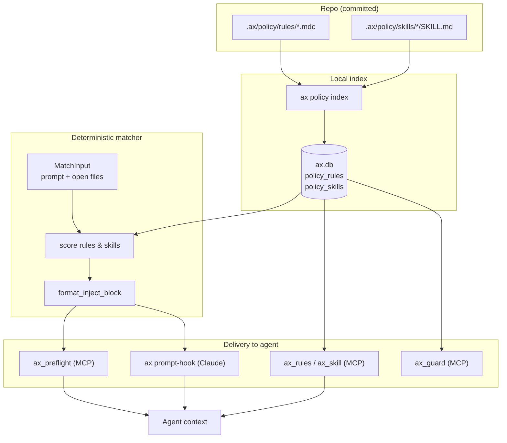
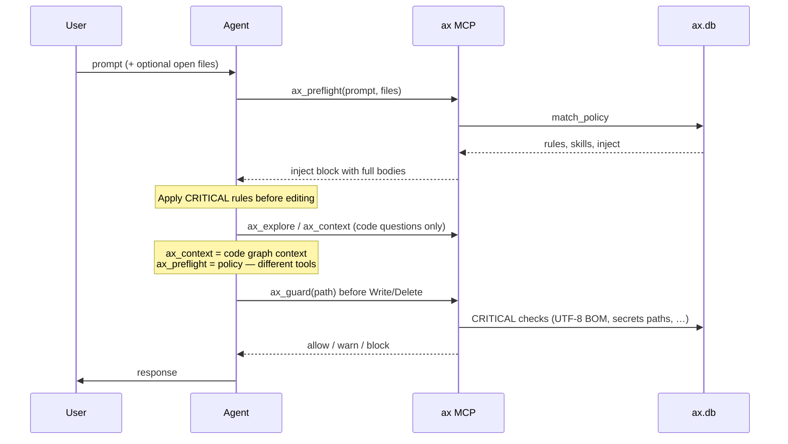

# ax Policy Engine

**Shipped in ax v2.0.0.** IDE-agnostic rules and skills for AI agents — stored in `.ax/policy/`, indexed locally, delivered via MCP, CLI, prompt-hook, and **ax web**.

Agents are **not** expected to open `.ax/policy/` files with a Read tool. Policy text is served from the SQLite index through MCP tools (or auto-injected by the prompt-hook).

## Quick start

```bash
ax init                    # creates .ax/policy/rules and skills dirs
ax policy index            # index policy files into ax.db
ax policy match "deploy"   # test which rules/skills match
ax web --open              # edit rules/skills in browser
```

Restart your agent after upgrading to ax **v2.0.0+** so MCP lists the policy tools.

---

## Architecture — source files to agent context

Filesystem is the **source of truth**. SQLite is the **delivery index**. The agent reads policy from MCP responses, not from disk.



### What each layer does

| Layer | Role |
|---|---|
| `.ax/policy/` | Human-edited rules (`.mdc`) and skills (`SKILL.md`) — commit to git |
| `ax policy index` | Parses frontmatter + body → SQLite tables `policy_rules`, `policy_skills` |
| `PolicyMatcher` | Keyword triggers, globs on open/changed files, `alwaysApply`, priority |
| `inject` string | Markdown block `<ax_policy>…</ax_policy>` with **full rule/skill bodies** |
| MCP / hook | Transports matched policy into the agent turn — no file reads required |

---

## Single agent turn — sequence



---

## Delivery channels by agent

| Channel | Cursor | Claude Code | Other MCP agents |
|---|---|---|---|
| **MCP pull** — agent calls `ax_preflight` | Yes (required) | Yes | Yes |
| **Prompt-hook push** — auto `<ax_policy>` inject | No | Yes (`UserPromptSubmit`) | If hook configured |
| **On demand** — `ax_skill(name)` | Yes | Yes | Yes |
| **Pre-write** — `ax_guard(path)` | Yes | Yes | Yes |

**Cursor:** ax install wires MCP only. Policy arrives when the agent **calls** `ax_preflight` at turn start (MCP `server_instructions` say so when `.ax/policy/` exists).

**Claude Code:** the hidden `ax prompt-hook` can push matched policy **before** the model sees the prompt, in addition to MCP tools.

Disable auto-inject: `AX_NO_POLICY=1`. Cap inject size: `AX_POLICY_MAX_CHARS` (default `16000`).

---

## Policy tools vs code tools

| Tool | Layer | Purpose |
|---|---|---|
| `ax_preflight` | **Policy** | Turn-start: matched rules + skills + `inject` text |
| `ax_rules` | **Policy** | List all rules or match against a prompt |
| `ax_skill` | **Policy** | Load one skill workflow by name |
| `ax_guard` | **Policy** | Pre-write gate for CRITICAL rules |
| `ax_explore` | **Code graph** | Structural Q&A — symbols, call paths, source |
| `ax_context` | **Code graph** | Task-oriented markdown from the graph |

Do **not** use `ax_context` for policy. Do **not** read `.ax/policy/skills/.../SKILL.md` when MCP policy tools are available.

---

## Authoring

### Rules — `.ax/policy/rules/<id>.mdc`

```yaml
---
id: mobile-first
level: CRITICAL
alwaysApply: false
globs: ["**/*.css", "**/*.tsx"]
triggers: ["mobile", "responsive"]
priority: 100
---
# Rule body (markdown)
```

### Skills — `.ax/policy/skills/<name>/SKILL.md`

```yaml
---
name: deploy
description: Use when user says deploy or zet live.
triggers: ["deploy", "zet live"]
---
# Workflow steps
```

Commit `.ax/policy/` to git — team-shared, IDE-agnostic.

---

## MCP tools

| Tool | Purpose |
|---|---|
| `ax_preflight` | Turn-start: matched rules + skills + `inject` |
| `ax_rules` | List or match rules |
| `ax_skill` | Load skill by name |
| `ax_guard` | Pre-write CRITICAL checks |
| `ax_explore` | Code structure (unchanged) |

Policy tools appear in `tools/list` only when `.ax/policy/` exists **and** has been indexed (`ax policy index`).

---

## CLI

```bash
ax policy index [--force]
ax policy match "prompt" [--file path] [--json]
ax policy rules [--json]
ax policy skills [--json]
ax policy skill <name>
ax policy guard --file path
```

---

## Environment

| Variable | Effect |
|---|---|
| `AX_NO_POLICY` | Skip policy in prompt-hook |
| `AX_POLICY_MAX_CHARS` | Injection cap (default 16000) |
| `AX_WEB_READONLY` | Browse-only ax web |

---

## ax web

```bash
ax web --port 7070 --open
```

Navigate to **Rules** or **Skills** in the sidebar. Edit frontmatter + markdown body, save to disk, auto re-index.

---

## Parallel instruction sources

ax policy does **not** replace IDE-specific config:

| Source | Loaded by |
|---|---|
| `.ax/policy/` | ax MCP + prompt-hook |
| `.cursor/rules`, `.cursor/skills` | Cursor (separate) |
| Recall MCP | Recall OS projects (separate) |

**Do not duplicate ax policy in `.cursor/rules/`.** Content under `.ax/policy/` must reach agents via `ax_preflight` MCP inject only. Files in `.cursor/rules/` with `alwaysApply: true` bypass MCP entirely.

Cursor-only conveniences (e.g. local dev skills) may remain in `.cursor/skills/`. Run `ax policy sync` to detect duplicate `.cursor/rules/` entries.

See [POLICY_ENGINE_PLAN.md](./POLICY_ENGINE_PLAN.md) for full architecture.
