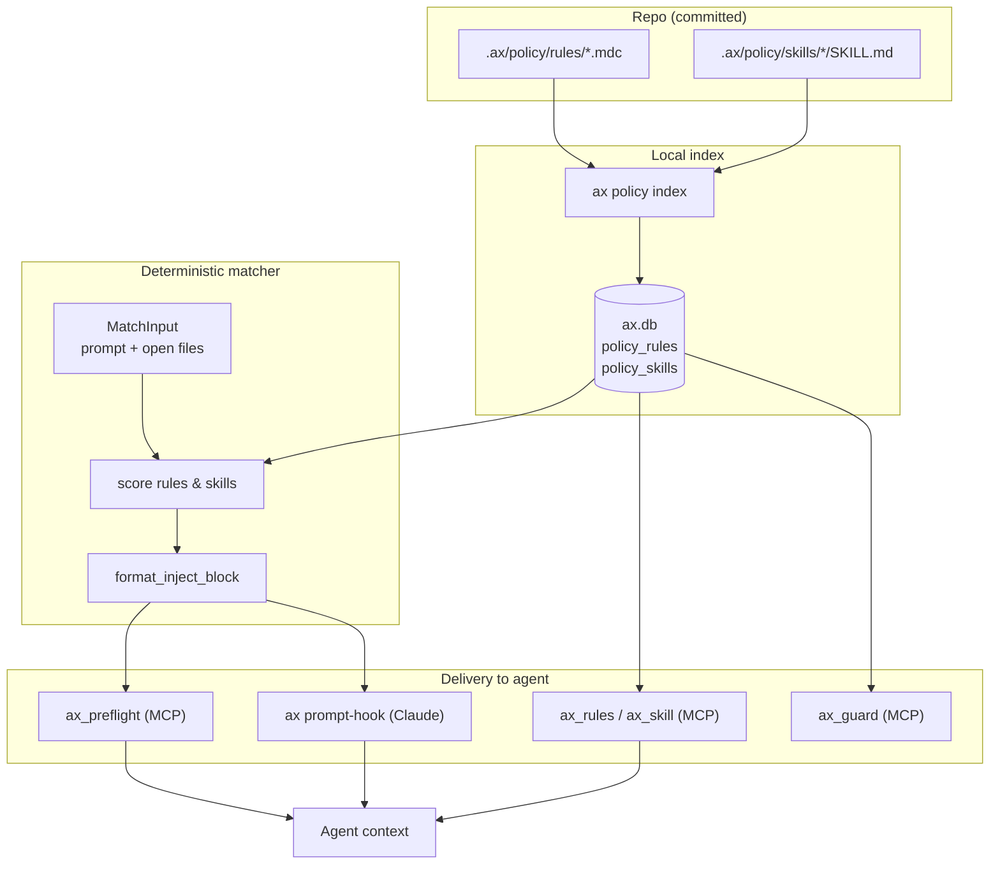
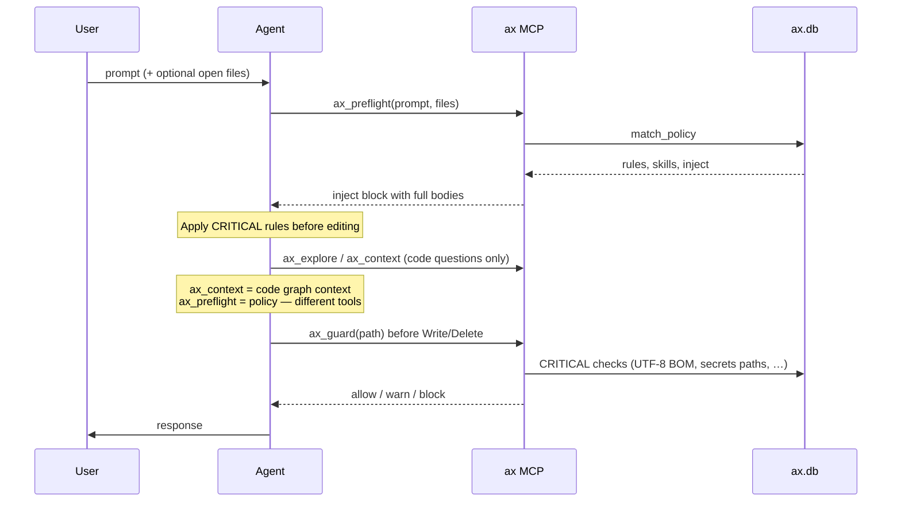

# ax Policy Engine

**Shipped in ax v2.0.0.** IDE-agnostic rules and skills for AI agents — stored in `.ax/policy/`, indexed locally, delivered via MCP, CLI, prompt-hook, and **ax web**.

Agents are **not** expected to open `.ax/policy/` files with a Read tool. Policy text is served from the SQLite index through MCP tools (or auto-injected by the prompt-hook).

## Quick start

```bash
ax init                    # creates .ax/policy/rules and skills dirs
ax policy index            # index policy files into ax.db
ax policy match "deploy"   # test which rules/skills match
ax web --open              # edit rules/skills in browser
```

Restart your agent after upgrading to ax **v2.1.2+** so MCP lists the policy tools (including `ax_policy_capture`).

---

## Policy capture (v2.1.1+)

Durable user directives in prompts (`always`, `you must`, `never`, `@rule`, Dutch equivalents) can be proposed as team rules.

1. **Detect** — `ax_policy::detect_directive()` or MCP `ax_policy_capture` with `action: "propose"`.
2. **Interview** — agent asks `questions[]` (level, globs, triggers, priority, …).
3. **Confirm** — save only after explicit user yes.
4. **Persist** — `PolicyStore::save_rule()` to database or files per `policy.storage`.

```bash
ax policy capture "always run tests before committing"       # preview
ax policy capture "you must not commit secrets" --yes        # save with defaults
```

Prompt-hook injects `<ax_capture_hint>` when a directive is detected. Set `AX_NO_POLICY_CAPTURE=1` to disable.

---

## Policy storage (v2.1.1+)

| Mode | Config | Notes |
|---|---|---|
| `files` | `"policy": { "storage": "files" }` in `ax.json` | Default; `.ax/policy/` is source of truth |
| `database` | `"policy": { "storage": "database" }` | Web UI and capture write to `ax.db` |

```bash
ax policy storage status
ax policy storage database --migrate           # propose: recursive repo scan + interview
ax policy storage database --migrate --yes     # apply: switch + import all
ax policy storage files --migrate              # export DB → disk on switch
ax policy storage database --global            # ~/.ax/config.json default
```

### Migration scan (v2.1.2+)

`--migrate` toward **database** recursively discovers `.mdc` rules and `SKILL.md` skills across the repo (`.ax/policy/`, `.cursor/rules/`, `.cursor/skills/`, monorepo subfolders). Each candidate includes interview questions (import, storage, id/name, level, triggers, globs, priority). Without `--yes` = propose only; with `--yes` = import into `ax.db`.

---

## Architecture — source files to agent context

Filesystem is the **source of truth**. SQLite is the **delivery index**. The agent reads policy from MCP responses, not from disk.


```mermaid
flowchart TB
  subgraph repo["Repo (committed)"]
    R[".ax/policy/rules/*.mdc"]
    S[".ax/policy/skills/*/SKILL.md"]
  end

  subgraph index["Local index"]
    CMD["ax policy index"]
    DB[("ax.db<br/>policy_rules<br/>policy_skills")]
  end

  subgraph match["Deterministic matcher"]
    MI["MatchInput<br/>prompt + open files"]
    M["score rules & skills"]
    INJ["format_inject_block"]
  end

  subgraph delivery["Delivery to agent"]
    PF["ax_preflight (MCP)"]
    RS["ax_rules / ax_skill (MCP)"]
    GD["ax_guard (MCP)"]
    HOOK["ax prompt-hook (Claude)"]
  end

  R --> CMD
  S --> CMD
  CMD --> DB
  DB --> M
  MI --> M
  M --> INJ
  INJ --> PF
  INJ --> HOOK
  DB --> RS
  DB --> GD
  PF --> AGENT["Agent context"]
  HOOK --> AGENT
  RS --> AGENT
```

### What each layer does

| Layer | Role |
|---|---|
| `.ax/policy/` | Human-edited rules (`.mdc`) and skills (`SKILL.md`) — commit to git |
| `ax policy index` | Parses frontmatter + body → SQLite tables `policy_rules`, `policy_skills` |
| `PolicyMatcher` | Keyword triggers, globs on open/changed files, `alwaysApply`, priority |
| `inject` string | Markdown block `<ax_policy>…</ax_policy>` with **full rule/skill bodies** |
| MCP / hook | Transports matched policy into the agent turn — no file reads required |

---

## Single agent turn — sequence


```mermaid
sequenceDiagram
  participant U as User
  participant A as Agent
  participant MCP as ax MCP
  participant DB as ax.db

  U->>A: prompt (+ optional open files)
  A->>MCP: ax_preflight(prompt, files)
  MCP->>DB: match_policy
  DB-->>MCP: rules, skills, inject
  MCP-->>A: inject block with full bodies
  Note over A: Apply CRITICAL rules before editing

  A->>MCP: ax_explore / ax_context (code questions only)
  Note over A: ax_context = code graph context<br/>ax_preflight = policy — different tools

  A->>MCP: ax_guard(path) before Write/Delete
  MCP->>DB: CRITICAL checks (UTF-8 BOM, secrets paths, …)
  MCP-->>A: allow / warn / block
  A->>U: response
```

---

## Delivery channels by agent

| Channel | Cursor | Claude Code | Other MCP agents |
|---|---|---|---|
| **MCP pull** — agent calls `ax_preflight` | Yes (required) | Yes | Yes |
| **Prompt-hook push** — auto `<ax_policy>` inject | No | Yes (`UserPromptSubmit`) | If hook configured |
| **On demand** — `ax_skill(name)` | Yes | Yes | Yes |
| **Pre-write** — `ax_guard(path)` | Yes | Yes | Yes |

**Cursor:** ax install wires MCP only. Policy arrives when the agent **calls** `ax_preflight` at turn start (MCP `server_instructions` say so when `.ax/policy/` exists).

**Claude Code:** the hidden `ax prompt-hook` can push matched policy **before** the model sees the prompt, in addition to MCP tools.

Disable auto-inject: `AX_NO_POLICY=1`. Cap inject size: `AX_POLICY_MAX_CHARS` (default `16000`).

---

## Policy tools vs code tools

| Tool | Layer | Purpose |
|---|---|---|
| `ax_preflight` | **Policy** | Turn-start: matched rules + skills + `inject` text |
| `ax_rules` | **Policy** | List all rules or match against a prompt |
| `ax_skill` | **Policy** | Load one skill workflow by name |
| `ax_guard` | **Policy** | Pre-write gate for CRITICAL rules |
| `ax_explore` | **Code graph** | Structural Q&A — symbols, call paths, source |
| `ax_context` | **Code graph** | Task-oriented markdown from the graph |

Do **not** use `ax_context` for policy. Do **not** read `.ax/policy/skills/.../SKILL.md` when MCP policy tools are available.

---

## Authoring

### Rules — `.ax/policy/rules/<id>.mdc`

```yaml
---
id: mobile-first
level: CRITICAL
alwaysApply: false
globs: ["**/*.css", "**/*.tsx"]
triggers: ["mobile", "responsive"]
priority: 100
---
# Rule body (markdown)
```

### Skills — `.ax/policy/skills/<name>/SKILL.md`

```yaml
---
name: deploy
description: Use when user says deploy or zet live.
triggers: ["deploy", "zet live"]
---
# Workflow steps
```

Commit `.ax/policy/` to git — team-shared, IDE-agnostic.

---

## MCP tools

| Tool | Purpose |
|---|---|
| `ax_preflight` | Turn-start: matched rules + skills + `inject` |
| `ax_rules` | List or match rules |
| `ax_skill` | Load skill by name |
| `ax_guard` | Pre-write CRITICAL checks |
| `ax_policy_capture` | Propose or save rule from directive language |
| `ax_explore` | Code structure (unchanged) |

Policy tools appear in `tools/list` only when `.ax/policy/` exists **and** has been indexed (`ax policy index`).

---

## CLI

```bash
ax policy index [--force]
ax policy match "prompt" [--file path] [--json]
ax policy rules [--json]
ax policy skills [--json]
ax policy skill <name>
ax policy guard --file path
ax policy capture <prompt> [--yes] [--json]
ax policy storage status [--json]
ax policy storage database [--migrate] [--yes] [--global] [--json]
ax policy storage files [--migrate] [--global] [--json]
```

---

## Environment

| Variable | Effect |
|---|---|
| `AX_NO_POLICY` | Skip policy in prompt-hook |
| `AX_NO_POLICY_CAPTURE` | Skip capture hints in prompt-hook |
| `AX_POLICY_MAX_CHARS` | Injection cap (default 16000) |
| `AX_WEB_READONLY` | Browse-only ax web |

---

## ax web

```bash
ax web --port 7070 --open
```

Navigate to **Rules** or **Skills** in the sidebar. Edit frontmatter + markdown body, save to disk, auto re-index.

---

## Parallel instruction sources

ax policy does **not** replace IDE-specific config:

| Source | Loaded by |
|---|---|
| `.ax/policy/` | ax MCP + prompt-hook |
| `.cursor/rules`, `.cursor/skills` | Cursor (separate) |
| Recall MCP | Recall OS projects (separate) |

**Do not duplicate ax team policy in `.cursor/rules/`.** Content under `.ax/policy/` must reach agents via `ax_preflight` MCP inject only.

**Exception — IDE bootstrap:** `ax init` seeds each agent's native instructions surface (create or repair). These files only tell the agent to call `ax_preflight`; they are not a substitute for team policy in `.ax/policy/`.

| IDE | Dedicated file | Default instructions link |
|-----|------------------|---------------------------|
| Cursor | `.cursor/rules/ax.mdc` | — (`alwaysApply` rule) |
| Claude Code | `.claude/rules/ax.md` | marker block in `.claude/CLAUDE.md` |
| Codex / opencode | — | marker block in `AGENTS.md` |
| Gemini CLI | — | marker block in `GEMINI.md` |

Legacy `.cursor/rules/ax-agent-workflow.mdc` is migrated to `ax.mdc` on init.

Cursor-only conveniences (e.g. local dev skills) may remain in `.cursor/skills/`. Run `ax policy sync` to detect duplicate `.cursor/rules/` entries.

See [POLICY_ENGINE_PLAN.md](./POLICY_ENGINE_PLAN.md) for full architecture.

---

## Troubleshooting

| Symptom | Fix |
|---|---|
| MCP `ax_rules` returns `[]` | Reload MCP; `ax policy import`; `ax daemon stop` |
| Preflight only shows `.cursor/rules/ax.mdc` | MCP not connected to project DB — reload MCP after reinstall |
| DB empty, files exist | `ax policy import` or `ax policy index --force` |
| Guard CLI parse error | Use `ax policy guard <file>` not `guard write <file>` |
| Verify full stack | `ax policy test` |

`ax_preflight` returns `policyStatus`, `matchedRules`, `matchedSkills`, `guardRequired`, and `inject`. AlwaysApply rules are never truncated from inject; contextual rules may be when `AX_POLICY_MAX_CHARS` is exceeded.
