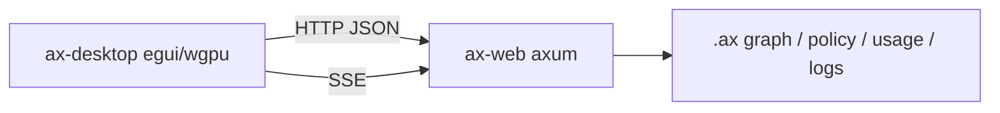

**ax** ships a browser Command Center via `ax web`. The **desktop client** is a separate native window (`egui` / `eframe` over **wgpu**) that embeds the same `ax-web` server in-process and talks to the identical `/api` JSON + SSE surface — no browser required.

## When to use it

| Client | Best for |
|--------|----------|
| `ax web` | Full CSS UI, Agent PTY terminal, share/LAN |
| `ax desktop` | Local GPU window, offline-friendly, same APIs without a browser |

Both read the same project graph (`.ax/ax.db`), policy, usage DB, MCP verbose logs, and Ship config.

## Prerequisites

1. Indexed project: `ax index` (or `ax init` then index) so `<root>/.ax/ax.db` exists.
2. A machine with a working wgpu backend (DirectX 12 / Vulkan / Metal).

## Quick start

```bash
ax desktop
ax desktop --port 17070
```

Or from a checkout of the ax repo (standalone binary):

```bash
cargo run -p ax-desktop-client -- .
cargo run -p ax-desktop-client -- /path/to/project --port 17070 --bind 127.0.0.1
```

Release build of the standalone binary (this workspace uses `target-dev/`):

```bash
cargo build --release -p ax-desktop-client
./target-dev/release/ax-desktop . --port 17070
```

On start you should see:

```text
ax desktop  starting embedded ax-web on http://127.0.0.1:17070
  Graph + policy: <canonical project path>
```

The window title is **ax — Command Center (desktop)**. Closing it stops the embedded server.

## Flags

| Argument / flag | Default | Description |
|-----------------|---------|-------------|
| `[path]` | current directory | Project root containing `.ax/ax.db` |
| `--port` | `7070` | Listen port for the embedded `ax-web` server |
| `--bind` | `127.0.0.1` | Bind address |

## Pages

The sidebar mirrors the browser route model:

- **Stats**, **Nodes**, **Graph** (force layout + SSE stream), **Files**, **Search**, **Memory**
- **Unresolved** (reconcile + LSP enrich)
- **Savings**, **Prices**
- **Ship** (Command Center evaluate / SSE pipeline)
- **Settings**, **Logging** (MCP verbose SSE + filters + inspector)
- **Policy** rules and skills (read/browse)
- **Agent** — session metadata stub; interactive PTY stays in `ax web` for now

## Architecture



The desktop process owns the listener. You do **not** need a separate `ax web` for the native client (you can still run `ax web` on another port for the browser).

## Related

- [Command Center](/guides/command-center/) — quality gates and `ax ship`
- [Token savings](/guides/token-savings/) — Savings / Prices data
- [MCP Logging & Quality](/guides/mcp-quality/) — Logging page source
- [CLI reference — ax web](/reference/cli/#ax-web-path) — browser UI
